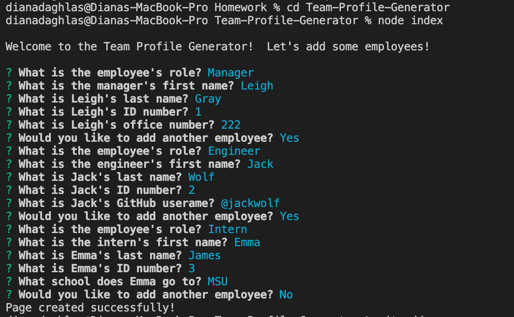
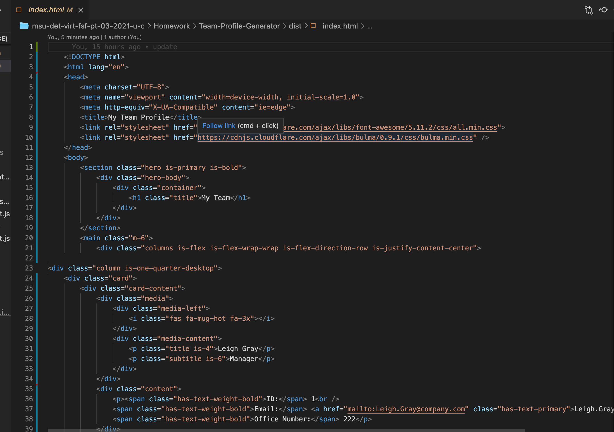
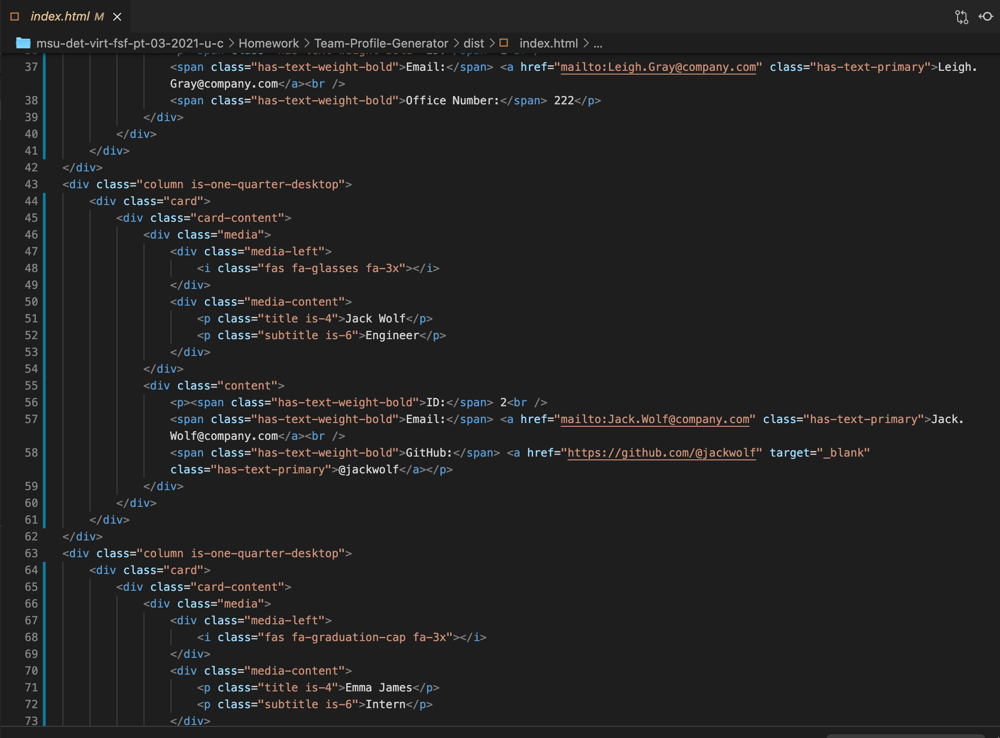

# Team Profile Generator

## Description

- I was tasked to build a Node.js command-line application that takes in information about employees on a software engineering team, then generates an HTML webpage that displays summaries for each person. Since testing is key to making code maintainable, I created 4 seperate test.js files for Employee, Engineer, Intern and Manager JS files. This ensures that the code I have written is running correctly. All code was written from scratch and each file contains comments describing what each function, class, and file are doing. 
- I created this application to assist a software engineering team manager who would like a generated HTML webpage that displays their teams basic information. This give the manager quick and easy access to each team-members email and/or GitHub profile. 
- Because this is not a deployed application, a link to a walkthrough video is provided within this README.md that demonstrates its functionality and all of the tests passing. 
  
  ## Table of Contents
  * [Installation](#installation)
  * [Usage](#usage)
  * [Contributing](#contributing)
  * [Tests](#tests)
  * [Questions](#questions?)

## Installation

- To use this application, please install:
```md
npm install inquirer
```
- GIVEN a command-line application that accepts user input. WHEN I am prompted for my team members and their information, THEN an HTML file is generated that displays a nicely formatted team roster based on user input. WHEN I click on an email address in the HTML, THEN my default email program opens and populates the TO field of the email with the address. WHEN I click on the GitHub username, THEN that GitHub profile opens in a new tab. WHEN I start the application, THEN I am prompted to enter the team manager’s name, employee ID, email address, and office number. WHEN I enter the team manager’s name, employee ID, email address, and office number, THEN I am presented with a menu with the option to add an engineer or an intern or to finish building my team. WHEN I select the engineer option, THEN I am prompted to enter the engineer’s name, ID, email, and GitHub username, and I am taken back to the menu. WHEN I select the intern option, THEN I am prompted to enter the intern’s name, ID, email, and school, and I am taken back to the menu. WHEN I decide to finish building my team, THEN I exit the application, and the HTML is generated.
## Usage
- A command-line application that dynamically generates a Team Profile HTML from a user's input using the [Inquirer package](https://www.npmjs.com/package/inquirer) for collecting input from the user and [Jest](https://www.npmjs.com/package/jest) for running the unit tests. 

- The application will be invoked by using the following command:

```bash
node index.js
```

- After cloning the repo and installing the required npm packages, use the command line to navigate to the root of the application and run node index. Follow prompts to add team members to your roster. Only one manager can be added per team. Your generated team roster page will be created in the ```./dist``` folder.

- Usage Tutorial: <br><br>
  [](https://drive.google.com/file/d/1LtkDfuSO4RbgHAz0lf0XmQrLOSsm6PmK/view?usp=sharing "Click Me!")<br><br>
  - Screenshots: <br><br>
  <br><br>
  <br><br>
  


## Contributing
  
  Contributions are accepted. Feel free to fork.


## Tests
To run tests on the application, install
```md
npm install jest
```
and run  `npm run test` from the command line.

  ---
  
  
  ## Questions?
  
  For any questions, please contact me with the information below:

  GitHub: [@ddaghlas](https://github.com/ddaghlas) 

